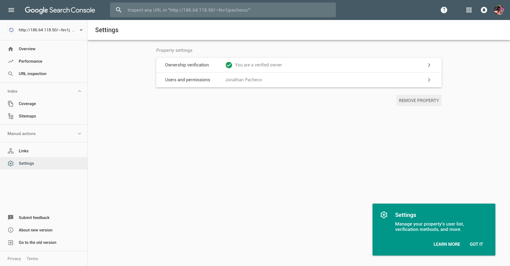

#Semana 12, ejercicio 2

#Sitio web en producción:
  http://186.64.118.50/~fev1jpacheco/

#Sitemap:
  http://186.64.118.50/~fev1jpacheco/sitemap.xml

#Integración de Google Search Console con el sitio web:
  

#Aspectos de seguridad que optimizados
 - Actualización de Wordpress y plugins instalados
 - Implementación de Wordfence
 - Selección de contraseñas seguras
 - Configuración de privilegios en CPanel
